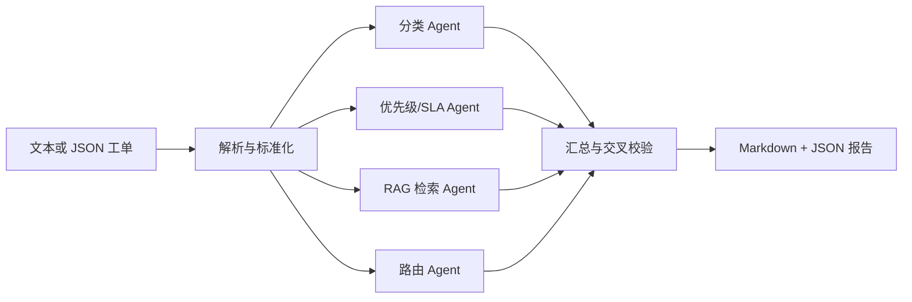

# IT Helpdesk 多智能体工单分诊系统

[](https://github.com/moliu64/IT-Helpdesk-/actions/workflows/tests.yml)
[](https://www.python.org/)
[](LICENSE)

一个面向企业 IT 运维场景的开源 AI Helpdesk 原型。系统接收文本或 JSON 工单，通过多个 Agent 完成问题分类、优先级与 SLA 评估、知识库检索和支持组路由，最终生成可供客服、工程师和系统使用的分诊报告。

> 本项目用于技术验证和面试演示，不替代生产环境中的 ITSM、权限审批或安全响应流程。仓库中的工单与知识库均为合成演示数据。

## 功能特性

- 工单标准化：从门户、邮件、聊天或电话记录中抽取统一字段。
- 多 Agent 分诊：分类、优先级/SLA、RAG 方案检索和路由建议分工协作。
- 本地 RAG：基于 Chroma 和 BGE 中文 Embedding，检索知识库与历史工单。
- 可靠输出：模型结果使用 `{"results": [...]}` 顶层结构，并经 Pydantic 校验和有限重试。
- 交叉校验：识别分类与路由冲突，对不满足条件的 P1 自动降级并记录原因。
- 多种入口：提供 Python CLI、对话 UI、后端监视/RAG 管理页和可选编排层。
- 可评测：内置知识库、历史工单、标注集、单元测试和评测脚本。

## 系统架构



分类、优先级和检索在 Python 入口中并行执行；路由使用分类结果进行最终分派，汇总层负责冲突检查和报告生成。详见 [docs/ARCHITECTURE.md](docs/ARCHITECTURE.md)。

## 技术栈

Python 3.10+ · DeepSeek OpenAI-compatible API · Pydantic · PyYAML · Chroma · sentence-transformers/BGE · 原生 Python HTTP Server

## 快速开始

### 中文启动入口

| 入口 | Windows 双击 | PowerShell / Linux/macOS | 用途 |
| --- | --- | --- | --- |
| 一键启动入口 | `一键启动.bat` | `一键启动.ps1` / `./start.sh` | 用户对话、工单提交和智能分诊 |
| 后台管理入口 | `后台管理入口.bat` | `后台管理入口.ps1` / `./start_backend.sh` | 工单、运行状态、RAG 知识库和访问记录 |

同一服务启动后，后台也可以从 `http://127.0.0.1:8787/backend` 或 `http://127.0.0.1:8787/admin` 进入。

### 1. 安装依赖

```powershell
python -m venv .venv
.\.venv\Scripts\Activate.ps1
python -m pip install -r requirements.txt
python -m pip install -r requirements-dev.txt
```

Linux/macOS：

```bash
python3 -m venv .venv
source .venv/bin/activate
python -m pip install -r requirements.txt
python -m pip install -r requirements-dev.txt
```

### 2. 配置 API Key

复制 `.env.example` 为 `.env`，填写 `LLM_API_KEY`。密钥只从环境变量读取，`.env` 已被 Git 忽略，禁止提交真实密钥。

首次使用本地 BGE 模型时需要联网下载模型。模型已缓存后，可设置以下变量离线运行：

```powershell
$env:HF_HUB_OFFLINE="1"
$env:TRANSFORMERS_OFFLINE="1"
```

### 3. 建立 RAG 索引并运行 CLI

```powershell
python scripts/build_index.py
python -m src.main --input data/raw/sample_ticket.txt
```

报告会写入 `outputs/<ticket_id>/report.md` 和 `outputs/<ticket_id>/report.json`。未配置 API Key 时，LLM Agent 会返回经过约束的空结果，不会导致程序崩溃。

### 4. 启动 Web UI

```powershell
./start.ps1
```

Windows 也可以双击 `start.bat`；Linux/macOS 使用 `./start.sh`。首次运行会自动创建 `.venv` 并安装运行依赖。浏览器打开 <http://127.0.0.1:8787>。后端监视与 RAG 管理位于 <http://127.0.0.1:8787/backend>，可导入 PDF、DOCX、MD、TXT 后重建本地索引。也可以单独启动后端监视页：Windows 双击 `start_backend.bat`（或执行 `./start_backend.ps1`），Linux/macOS 执行 `./start_backend.sh`，默认访问 <http://127.0.0.1:8788/backend>。导入文本按 900 字符切分，固定保留 15% 上下文重叠。UI 数据保存在本地 `ui/helpdesk.db`，上传文件位于 `data/knowledge/imports/`；二者均不会提交到仓库。此 UI 没有生产级认证和权限控制，请勿直接暴露到公网。

后端页面的“工单管理”区会汇总所有用户已提交工单，并显示分类、优先级、路由和描述。运维人员可以按工单号、标题、用户或描述搜索，也可以按“未解决 / 已解决”筛选；更新状态时填写处理备注（例如复现结果、采取的措施、回访结论），系统会保存状态更新时间并同步到该工单的报告数据，便于后续统计完成量和复盘处理过程。

### 5. 在线部署

构建命令使用 `python -m pip install -r requirements.txt`，启动命令使用 `python scripts/start.py`。平台通常会注入 `PORT`；应用会读取它，线上建议设置 `HELPDESK_HOST=0.0.0.0`。健康检查地址为 `/healthz`。线上必须配置 `LLM_API_KEY`，不要上传 `.env`、SQLite 数据库或本地向量索引。正式上线前请在网关增加 HTTPS、认证和请求限流。

### 6. Cloudflare 部署（06015.top）

本项目是 Python 后端，Cloudflare 负责域名、HTTPS 和 Tunnel 代理，应用运行在一台可持续运行的 Windows/Linux 主机上。部署模板位于 [`deploy/06015.top/`](deploy/06015.top/)，包括 Cloudflare Tunnel、Docker Compose、systemd 和 Nginx 方案。

线上入口：

- 用户入口：<https://06015.top/>
- 中文后台管理入口：<https://06015.top/backend>
- 兼容后台入口：<https://06015.top/admin>
- 健康检查：<https://06015.top/healthz>

后台包含工单、知识库、运行日志和访问记录，必须在 Cloudflare Access 或其他网关中增加身份认证。不要把 API Key、SQLite 数据库、用户上传文件和本地向量索引提交到 GitHub。完整步骤见 [`docs/启动与部署说明.md`](docs/启动与部署说明.md)。

## 评测与测试

```bash
python -m pytest tests -q
python -m ruff check src scripts tests ui
python scripts/evaluate.py
```

评测脚本读取 `data/annotated/helpdesk_eval.json`，计算分类准确率、优先级准确率和 RAG Top-3 命中率，并写入 `outputs/eval_result.json`。未配置 API Key 时会记录 `not_run`，不会生成虚构指标。

## 项目结构

```text
.
├── .github/workflows/       # GitHub Actions 持续集成
├── config/                 # 模型、Embedding、RAG 和业务配置
├── data/
│   ├── raw/                # 输入样例
│   ├── knowledge/          # 合成 KB 文章
│   ├── tickets/            # 合成历史工单；index/ 为生成目录
│   └── annotated/          # 合成评测集与 gold 标注
├── docs/                   # 架构文档
│   └── 启动与部署说明.md    # 中文入口与线上部署说明
├── deploy/06015.top/       # 06015.top Cloudflare/容器/网关模板
├── scripts/                # 建库、造数和评测脚本
│   └── start.py             # 跨平台 Web 启动入口
├── src/
│   ├── agents/             # 分类、优先级、检索和路由 Agent
│   ├── agent_graph.py       # 可选 LangGraph / Python 回退编排
│   ├── intent.py            # 对话意图识别与分流
│   ├── rag/                # 向量库封装
│   ├── ticket_parser.py    # 工单解析
│   ├── report.py           # 汇总、校验和报告生成
│   └── main.py             # CLI 入口
├── tests/                  # 自动化测试
├── ui/                     # 本地 Web UI 与服务端
├── workflow/               # 可选 DeepSeek Harness 编排
├── CONTRIBUTING.md
├── LICENSE
└── requirements*.txt
```

仓库根目录的 `start.bat`、`start.ps1`、`start.sh` 和中文“一键启动”入口都调用同一个 `scripts/start.py`，避免不同平台维护多套启动逻辑。

`legacy_contract_review/` 是历史合同审查项目的只读归档，不属于当前运行链路，当前项目不会 import 它。

## 配置说明

业务类别、支持组、SLA 时限、模型名、Embedding provider 和索引路径均位于 [`config/config.yaml`](config/config.yaml)。API Key 通过 `LLM_API_KEY` 环境变量提供。

视觉理解模型通过 `LLM_VISION_MODEL` 配置，默认值为 `DeepSeek-V4-Flash-Vision-Exp`。不要将密钥写入配置、测试数据或文档。

## 开源协作

欢迎提交 Issue 和 Pull Request。提交代码前请阅读 [CONTRIBUTING.md](CONTRIBUTING.md)，并确保测试通过。项目采用 [MIT License](LICENSE)。

## 已知限制

- 本地 BGE 模型首次下载和 Chroma 建库需要一定磁盘空间与时间。
- 默认 UI 仅监听 `127.0.0.1`，不包含生产级认证、审计和多租户隔离。
- 评测指标需在配置有效的 API Key 下实际运行后再用于对外宣传。
