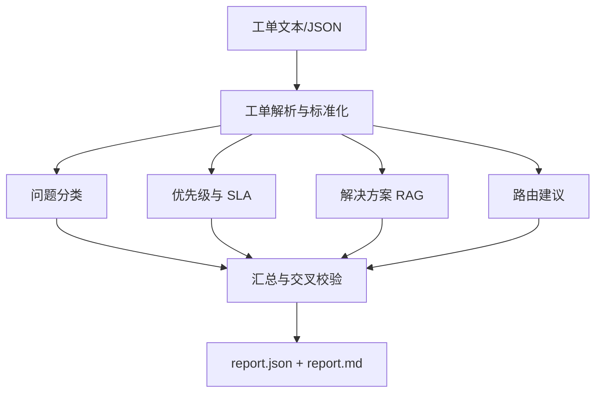

# IT 运维工单 Helpdesk 智能体

输入一条 IT 工单文本或 JSON，系统将工单标准化后交给四路审查 Agent：问题分类、优先级与 SLA、历史工单/知识库 RAG 检索、支持组路由；最后生成分诊报告、用户回复草稿、工程师处理建议和自动标签。

## 架构



四路 Agent 的 JSON 输出都要求顶层为 `{"results": [...]}`，并经过 Pydantic 校验和最多三次重试。汇总层会检查分类-路由冲突，并对不满足影响面条件的 P1 自动降级。

## 快速开始

先复制 `.env.example` 为 `.env`，然后填写自己的 DeepSeek key。`.env` 已被 Git 忽略，不会提交到仓库。

PowerShell：

```powershell
Copy-Item .env.example .env
# 编辑 .env，填写 LLM_API_KEY
python -m pip install -r requirements.txt
python scripts/build_index.py
python -m src.main --input data/raw/sample_ticket.txt
```

启动本地 Web UI：

```powershell
python ui/server.py 8787
```

打开 <http://127.0.0.1:8787>。UI 支持固定字段录入、按用户隔离历史会话、历史工单搜索、RAG 方案查看和报告回读。

Linux/macOS：

```bash
export LLM_API_KEY="你的 DeepSeek API Key"
export HF_HUB_OFFLINE=1
export TRANSFORMERS_OFFLINE=1
python -m pip install -r requirements.txt
python scripts/build_index.py
python -m src.main --input data/raw/sample_ticket.txt
```

报告输出到 `outputs/<ticket_id>/report.json` 和 `outputs/<ticket_id>/report.md`。API key 只从 `LLM_API_KEY` 环境变量读取，不写入代码或配置文件。

## RAG 与数据

RAG 使用本地缓存的 BGE 中文模型 `BAAI/bge-small-zh-v1.5` 和 Chroma。配置中的 `embedding.provider` 为 `local`，不调用 OpenAI embedding；运行建库或检索前应设置两个离线变量，避免访问 huggingface.co：

```powershell
$env:HF_HUB_OFFLINE="1"; $env:TRANSFORMERS_OFFLINE="1"
```

当前语料包含 24 篇 KB 和 64 条历史工单，历史工单 8 个类别各 8 条，resolution 是针对具体问题的 3~5 步操作步骤。

## 效果示例

对 `data/raw/sample_ticket.txt`（"VPN 无法连接"）的真实报告片段：

```text
## 分诊结论
- 分类：网络连接 / VPN连接问题（置信度 0.95）
- 优先级：P3，SLA：8 小时
- 路由：网络组

## 相似解决方案
- 来源：HIST-0009；标题：VPN 连接超时；相关度：高；步骤：确认客户端能访问 VPN 网关；校准系统时间并清理 VPN 缓存；切换到备用网关重试；导出客户端日志和错误时间交网络组
- 来源：KB-0001；标题：VPN 客户端连接超时；相关度：高；步骤：确认本地网络可访问互联网；校准系统时间并重新登录；切换网络后重试；仍失败时收集客户端日志交网络组

## 自动标签
#网络连接 #VPN连接问题 #P3
```

## Phase 7 评测

评测集位于 `data/annotated/helpdesk_eval.json`，共 32 条与历史工单不重复的工单，category 和 priority 均有 gold 标注。运行：

```powershell
$env:LLM_API_KEY="你的 DeepSeek API Key"
$env:HF_HUB_OFFLINE="1"; $env:TRANSFORMERS_OFFLINE="1"
python scripts/evaluate.py
```

脚本计算分类准确率、优先级准确率和 RAG Top-3 命中率，并写入 `outputs/eval_result.json`。指标必须在配置有效的 `LLM_API_KEY` 环境下实际运行后再记录；没有 key 时脚本会写入 `status: not_run`，不会伪造数字。

当前开发环境未提交可复现的真实模型指标；运行评测脚本后，将 `outputs/eval_result.json` 中的结果填入发布说明。

## 为什么使用多 Agent

分类、SLA、检索和路由职责单一，可以并行提速并独立调优；汇总层再做交叉校验，尤其能降低 P1 误判和分类/路由不一致带来的分派错误。解决方案只展示 RAG 实际检索结果，检索不到时明确提示人工排查，不编造知识库内容。

## Harness 编排（DSH workflow）

项目提供两个等价的编排入口：

1. **Python 版**（默认）：`src/main.py` 依次执行解析、分类、优先级、RAG 检索和路由，并通过统一报告层生成结果，生产可直接运行。
2. **DSH workflow 版**：`workflow/helpdesk.workflow.js` 用 DeepSeek Harness 原生的 `parallel()` + subagent fan-out 编排同样的四路 Agent，展示「多智能体编排」的 Harness 实现。

DSH 版在 workflow 工具中运行：`meta` 填项目信息、`args.ticket` 传工单文本、`script` 填 `workflow/helpdesk.workflow.js` 的内容。每个 subagent 用 JSON Schema 校验输出，与 Python 版的数据契约一致；解决方案由 subagent 读取 `data/knowledge` 与 `data/tickets` 语料检索（生产级 RAG 用 Chroma+BGE 见 `src/rag/vector_store.py`）。

## 测试

```powershell
python -m pytest tests -q
```

## GitHub 发布清单

- 提交 `.env.example`，不要提交 `.env`、`ui/helpdesk.db`、`outputs/` 或 `data/tickets/index/`。
- 在 GitHub Actions 或本机设置 `LLM_API_KEY`，不要把 key 写入 YAML、README 或源码。
- 首次运行前设置 `HF_HUB_OFFLINE=1` 和 `TRANSFORMERS_OFFLINE=1`，确保使用本地缓存的 BGE 模型。
- `legacy_contract_review/` 是历史合同项目归档，仅保留作迁移参考，运行代码不会 import 它。
